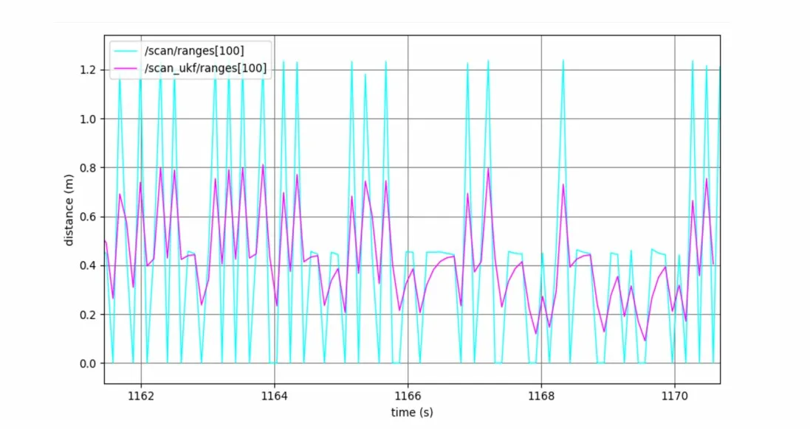
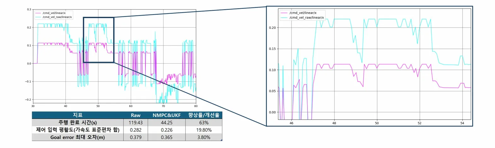
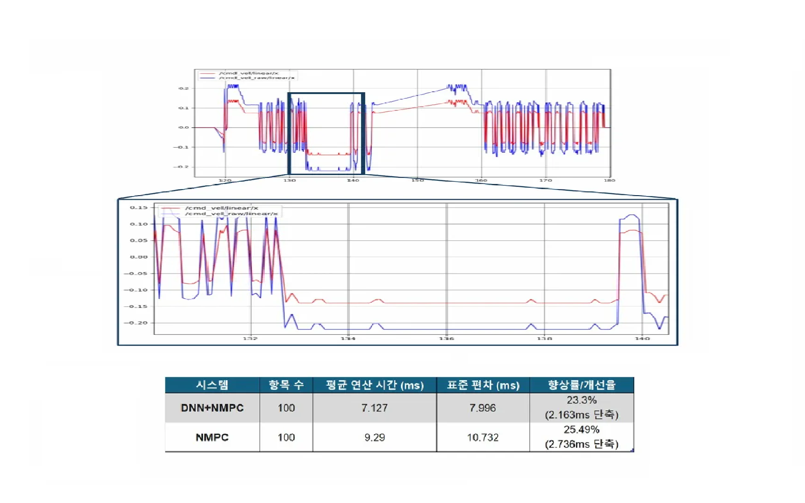

# 🤖 TurtleBot3 Autonomous Driving System

### UKF · LiDAR · DNN · NMPC 기반 지능형 자율주행 제어 시스템

> **Graduation Project** — 비선형 상태 추정 · 센서 융합 · 최적 제어의 완전 통합 구현  
> ROS1 (Melodic / Noetic) · TurtleBot3 Burger Pi · Python

[](http://wiki.ros.org)
[](https://python.org)
[](https://pytorch.org)

---

## 📌 프로젝트 개요

TurtleBot3 (Burger Pi)를 플랫폼으로, LiDAR · IMU · Odometry 데이터를 활용하여  
**UKF 기반 상태 추정 → NMPC 기반 최적 제어** 파이프라인을 설계·구현한 자율주행 시스템입니다.

추가적으로 **DNN이 NMPC의 미래 예측 모델 f(x,u)를 근사**함으로써 연산 복잡도를 줄이고,  
초기 제어 입력을 예측하여 최적화 수렴 속도를 향상시켜 **실시간 제어 성능을 확보**하였습니다.

| 항목 | 내용 |
|---|---|
| 플랫폼 | TurtleBot3 Burger Pi |
| 환경 | ROS1 (Melodic / Noetic) |
| 언어 | Python |
| 핵심 알고리즘 | UKF · NMPC · DNN |

---

## 🏗️ 시스템 아키텍처

```
[Sensor Input]
  LiDAR (/scan)  │  IMU (/imu)  │  Odometry (/odom)
                 │
                 ▼
        ┌─────────────────────┐
        │    UKF Estimator    │  ← 센서 융합 + LiDAR 노이즈 제거
        │    (ukf_node.py)    │    상태 추정: (x, y, θ, v)
        └──────────┬──────────┘
                   │ /scan_ukf  ·  /ukf_pose
                   ▼
        ┌─────────────────────┐
        │   NMPC Controller   │  ← UKF 상태 기반 최적 제어
        │  + DNN Accelerator  │    DNN이 f(x,u) 근사 → 수렴 가속
        │   (nmpc_solver.py)  │
        └──────────┬──────────┘
                   │ /cmd_vel
                   ▼
          [TurtleBot3 Motion]
```

**DNN의 역할 (NMPC 내부 가속기):**
- NMPC의 미래 예측 모델 `f(x, u)`를 신경망으로 근사하여 예측 계산을 단순화
- NMPC의 초기 제어 입력을 예측하여 최적화 수렴 속도 향상
- NMPC의 비용함수와 제약조건은 그대로 유지 → 최적화 구조 보존

---

## 🎥 시연 영상

| # | 내용 | 링크 |
|---|---|---|
| 1 | 알고리즘 미적용 vs UKF+NMPC+DNN 비교 주행 | [▶ YouTube](https://youtu.be/ziqB8M-Hwmk) |

---

## 📐 핵심 알고리즘

### 1. UKF (Unscented Kalman Filter) — 본인 핵심 구현 파트

로봇 운동 모델(x = v·cos θ, y = v·sin θ)의 삼각함수 비선형성으로 인해 EKF의 야코비안 선형화 오차가 커질 수 있어,
Sigma Point를 비선형 함수에 직접 통과시켜 더 정확한 추정이 가능한 **Unscented Kalman Filter**를 채택하였습니다.

**Prediction Step**
```
χ  = sigma_points(x̂, P)
x̂⁻ = Σ Wᵢ · f(χᵢ, u)               # 비선형 운동 모델 적용
P⁻  = Σ Wᵢ · (χᵢ - x̂⁻)(...)ᵀ + Q
```

**Update Step**
```
z  = h(χ)                             # 측정 모델 적용 (LiDAR)
K  = Pxz · Pzz⁻¹                     # 칼만 게인 계산
x̂  = x̂⁻ + K · (z_meas - z)          # 상태 보정
P  = P⁻ - K · Pzz · Kᵀ
```

- `/scan` → 이상값 제거 → `/scan_ukf` 퍼블리시
- IMU + Odometry 융합으로 위치/속도/자세각 안정 추정
- 출력 상태 `(x, y, θ, v)` → NMPC 입력으로 전달

---

### 2. NMPC (Nonlinear Model Predictive Control)

UKF로부터 안정화된 상태를 입력받아, 매 제어 주기마다 **비용 함수를 최소화하는 최적 제어 입력**을 계산합니다.

**비용 함수 (Cost Function)**
```
J = Σ [ w₁·||e_pos||² + w₂·||e_vel||² + w₃·||Δu||² ]

e_pos : 목표 경로와의 위치 오차
e_vel : 목표 속도와의 오차
Δu    : 제어 입력 변화량 (진동 억제)
```

---

### 3. DNN — NMPC 연산 가속

NMPC의 미래 예측 모델 `f(x, u)`를 DNN으로 근사하여 계산 복잡도를 줄이고,  
초기 제어 입력값을 예측함으로써 최적화 수렴 속도를 향상시켰습니다.

```
Input:  현재 상태 (x, y, θ, v) + 제어 입력 (v_cmd, ω_cmd)
Output: 다음 상태 예측 x(t+1)   ← f(x, u) 근사
```

NMPC의 비용함수와 제약조건 구조는 그대로 유지하면서 연산 속도만 향상시킨 것이 핵심입니다.

---

## 📊 실험 결과

### UKF 적용 효과 — LiDAR 노이즈 제거



| 지표 | Raw `/scan` | UKF `/scan_ukf` |
|---|---|---|
| 거리 변동 범위 | 0 ~ 1.25m 스파이크 빈번 | 안정적 곡선 유지 |
| 이상값 발생 | 수시로 발생 | 제거됨 |

> `/scan/ranges[100]` 기준, UKF 적용 후 스파이크성 이상값이 제거되어  
> NMPC에 안정적인 상태 추정값이 전달됩니다.

---

### NMPC + UKF 적용 효과 — 제어 성능



| 지표 | Raw | NMPC + UKF | 향상률 |
|---|---|---|---|
| 주행 완료 시간 (s) | 119.43 | 44.25 | **63% 단축** |
| 제어 입력 평활도 (가속도 표준편차 합) | 0.282 | 0.226 | **19.80% 향상** |
| Goal error 최대 오차 (m) | 0.379 | 0.365 | **3.80% 감소** |

> UKF를 통해 센서 노이즈를 제거함으로써 NMPC 입력 안정성을 확보하고,  
> 제어 입력 진동을 감소시켜 부드러운 trajectory tracking을 구현하였습니다.

---

### DNN + NMPC 연산 성능



| 시스템 | 항목 수 | 평균 연산 시간 (ms) | 표준 편차 (ms) | 향상률 |
|---|---|---|---|---|
| NMPC 단독 | 100 | 9.290 | 10.732 | 기준 |
| DNN + NMPC | 100 | 7.127 | 7.996 | **평균 23.3% 단축 / 표준편차 25.49% 감소** |

> DNN이 NMPC의 예측 모델을 근사하여 연산 복잡도를 줄이고,  
> 초기 제어 입력을 예측하여 수렴 속도를 향상시킨 결과입니다.  
> **제어 안정성을 유지하면서 실시간 제어 시스템 구현 가능성을 확인하였습니다.**

---

## 🗂️ 디렉터리 구조

```
turtlebot3-autonomous-driving/
├── ukf/
│   ├── ukf_node.py              # UKF 메인 ROS 노드
│   ├── motion_model.py          # 비선형 운동 모델 f(x,u)
│   └── measurement_model.py     # 센서 측정 모델 h(x)
├── lidar/
│   └── lidar_preprocess.py      # LiDAR 노이즈 제거 및 이상값 필터링
├── dnn/
│   ├── dnn_model.py             # DNN 추론 노드 (f(x,u) 근사)
│   └── train_model.ipynb        # 모델 학습 노트북
├── nmpc/
│   ├── nmpc_solver.py           # NMPC 최적화 솔버
│   └── cost_function.py         # 비용 함수 정의
├── launch/
│   ├── ukf.launch
│   ├── nmpc.launch
│   └── full_system.launch
├── docs/
│   ├── ukf_lidar_comparison.png
│   ├── nmpc_ukf_comparison.png
│   └── dnn_nmpc_comparison.png
└── README.md
```

---

## 🔧 실행 방법

### 환경 요구사항

```
ROS1 Melodic 또는 Noetic
Python 3.x
PyTorch
TurtleBot3 패키지
```

### 설치

```bash
cd ~/catkin_ws/src
git clone https://github.com/seongjin-yoon/turtlebot3-autonomous-driving.git
cd ~/catkin_ws && catkin_make
source devel/setup.bash
```

### 실행

```bash
# UKF만 실행
roslaunch turtlebot3_autonomous ukf.launch

# NMPC만 실행
roslaunch turtlebot3_autonomous nmpc.launch

# 전체 시스템 실행
roslaunch turtlebot3_autonomous full_system.launch
```

### 주요 ROS 토픽

| 토픽 | 방향 | 설명 |
|---|---|---|
| `/scan` | Input | Raw LiDAR 데이터 |
| `/imu` | Input | IMU 데이터 |
| `/odom` | Input | Odometry 데이터 |
| `/scan_ukf` | UKF Output | UKF 필터링된 LiDAR |
| `/ukf_pose` | UKF Output | 추정 상태 (x, y, θ, v) |
| `/cmd_vel` | NMPC Output | 최적 제어 명령 |

---

## 👤 기여 내역

| 파트 | 내용 | 역할 |
|---|---|---|
| **UKF 상태 추정** | 비선형 운동 모델 · 측정 모델 · Sigma point 설계 전체 | **주담당** |
| **센서 융합** | IMU + Odometry + LiDAR 융합 구조 설계 | **주담당** |
| **LiDAR 전처리** | 이상값 제거 파이프라인 | 참여 |
| **DNN 연동** | f(x,u) 근사 모델 NMPC 연결 | 참여 |
| **시스템 통합** | ROS 노드 연결 · launch 파일 제작 | 참여 |

---

## 🔮 향후 발전 방향

| 현재 | 개선 방향 |
|---|---|
| UKF | Factor-Graph 기반 Back-End 확장 |
| DNN (f(x,u) 근사) | Transformer 기반 모델 예측 |
| NMPC | 강화학습 기반 Adaptive MPC |
| TurtleBot3 (소형) | 실차 규모 플랫폼 확장 |
| ROS1 | ROS2 마이그레이션 |

---

<div align="center">

Graduation Project · ROS1 Autonomous Driving · TurtleBot3 Burger Pi

</div>
